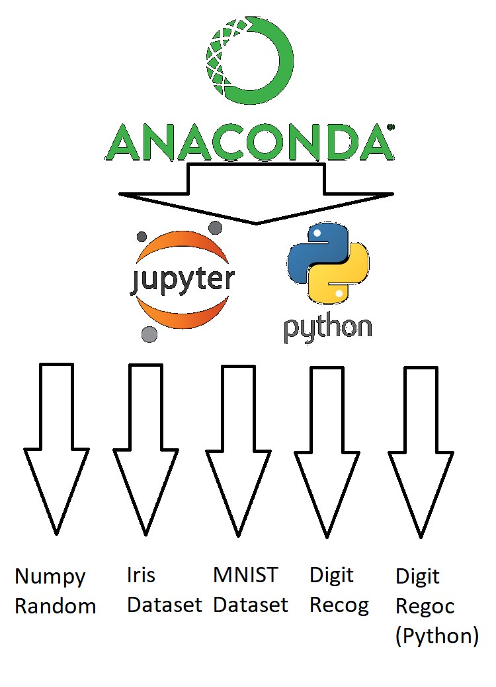

# Emerging Technologies Project

Project Repository for 4th Year module "Emerging Technologies". This project required us to write documentation and code in the programming language python using the jupyter notebook software.

<ul>
    <li>Requirements</li>
    <li>Design</li>
    <li>Running the code</li>
    <li>Resources and References</li>
</ul>

## Requirements

We were required to write four notebooks and one python script using the jupyter notebook software. The titles of these files were the following [1] :

### numpy random notebook - 
   A jupyter notebook explaining the concepts behind and the use of the numpy random package, including plots of the various distributions.
### Iris dataset notebook -
   A jupyter notebook explaining the famous iris data set including the difficulty in writing an algorithm to separate the three classes of iris based on the variables in the dataset.
### MNIST dataset notebook -
   A jupyter notebook explaining how to read the MNIST dataset efficiently into memory in Python.
### Digit recognition script -
   A Python script that takes an image file containing a handwritten digit and identifies the digit using a supervised learning algorithm and the MNIST dataset.
### Digit recognition notebook -
   A jupyter notebook explaining how the above Python script works and discussing its performance.

## Design

### Python 

Python is an interpreted, object-oriented, high-level programming language with dynamic semantics. Its high-level built in data structures, combined with dynamic typing and dynamic binding, make it very attractive for Rapid Application Development, as well as for use as a scripting or glue language to connect existing components together [2] . For this project we used python for the Digit Recognition Script and it was also used throughout the jupyter notebooks.

### Jupyter 

The Jupyter Notebook is an open-source web application that allows you to create and share documents that contain live code, equations, visualizations and narrative text. Uses include: data cleaning and transformation, numerical simulation, statistical modeling, data visualization, machine learning, and much more [3] . Rather than using the console based approach, the jupyter notebook focuses on using a web based application for the interactive authoring of documents which combine explanatory text, mathematics, computations and their rich media output [4] . We were required to use the jupyter notebooks for our project by designing notebooks for the numpy random package, iris dataset, MNIST dataset and digit recognition.

### Anaconda 

Anaconda is a python and R distribution. It aims to provide everything you need (python wise) for data science "out of the box". It includes the core python language, over 100 packages and libaries for python and the jupyter software. It also contains a package manager which can be used to update its packages and add more if needed. We used anaconda for this project as it contained everything we needed to complete this project, all in one installation. Adapted from <a href="https://stackoverflow.com/questions/42096280/how-is-anaconda-related-to-python">here.</a>

## Resources and References

   [1] <a href="https://github.com/ianmcloughlin/jupyter-teaching-notebooks/blob/master/pandas-with-iris.ipynb"> Project Requirements Doc</a>
   [2] <a href="https://www.python.org/doc/essays/blurb/">Python Decs</a>
   [3] <a href="http://jupyter.org/">Jupyter site</a>
   [4] <a href="https://jupyter-notebook.readthedocs.io/en/latest/notebook.html">Jupyter Notebook Docs</a>
   
   

##### Ryan Conway
