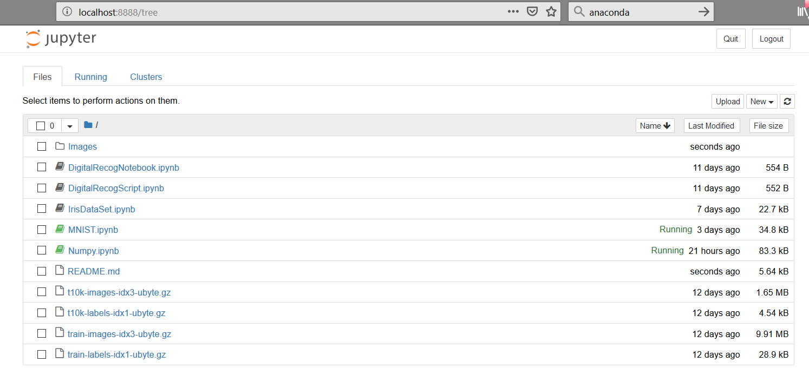

# Emerging Technologies Project

Project Repository for 4th Year module "Emerging Technologies". This project required us to write documentation and code in the programming language python using the jupyter notebook software.

<ul>
    <li>Requirements</li>
    <li>Design</li>
    <li>Running the code</li>
    <li>Resources and References</li>
</ul>

## Requirements

We were required to write four notebooks and one python script using the jupyter notebook software. The titles of these files were the following [1] :

### numpy random notebook - 
   A jupyter notebook explaining the concepts behind and the use of the numpy random package, including plots of the various distributions.
### Iris dataset notebook -
   A jupyter notebook explaining the famous iris data set including the difficulty in writing an algorithm to separate the three classes of iris based on the variables in the dataset.
### MNIST dataset notebook -
   A jupyter notebook explaining how to read the MNIST dataset efficiently into memory in Python.
### Digit recognition script -
   A Python script that takes an image file containing a handwritten digit and identifies the digit using a supervised learning algorithm and the MNIST dataset.
### Digit recognition notebook -
   A jupyter notebook explaining how the above Python script works and discussing its performance.

## Design

### Python 

Python is an interpreted, object-oriented, high-level programming language with dynamic semantics. Its high-level built in data structures, combined with dynamic typing and dynamic binding, make it very attractive for Rapid Application Development, as well as for use as a scripting or glue language to connect existing components together [2] . For this project we used python for the Digit Recognition Script and it was also used throughout the jupyter notebooks.

### Jupyter 

The Jupyter Notebook is an open-source web application that allows you to create and share documents that contain live code, equations, visualizations and narrative text. Uses include: data cleaning and transformation, numerical simulation, statistical modeling, data visualization, machine learning, and much more [3] . Rather than using the console based approach, the jupyter notebook focuses on using a web based application for the interactive authoring of documents which combine explanatory text, mathematics, computations and their rich media output [4] . We were required to use the jupyter notebooks for our project by designing notebooks for the numpy random package, iris dataset, MNIST dataset and digit recognition.

### Anaconda 

Anaconda is a python and R distribution. It aims to provide everything you need (python wise) for data science "out of the box". It includes the core python language, over 100 packages and libaries for python and the jupyter software. It also contains a package manager which can be used to update its packages and add more if needed. We used anaconda for this project as it contained everything we needed to complete this project, all in one installation. Adapted from <a href="https://stackoverflow.com/questions/42096280/how-is-anaconda-related-to-python">here.</a>

## Running the code

To run this project and its notebooks, you first clone the git repository to your own desktop. You can do this by using the command line to navigate to your prefered directory and run the following command:

    git clone https://github.com/RCElucidator7/EmergingTechProject.git
    
You can also chose to download the ZIP file and extract that where ever you please.

Once that is done, you use the command prompt to navigate to the directory where this package is stored and run the following command:

    jupyter notebook
    
Assuming you have jupyter already installed, your web browser should open at http://localhost:8888 . If this does not happen it may be due to the fact you dont have jupyter installed on your machine. If this is the case, you can follow a guide <a href="https://jupyter.readthedocs.io/en/latest/install.html">here</a> on how to install jupyter, or <a href="https://conda.io/docs/user-guide/install/index.html">here</a> to install Anaconda which uses jupyter.

The default home page should be at the address http://localhost:8888/tree. Personally, I would change the /tree to /lab instead as I prefer the layout, but you can use either. If you are using /tree, it should display a list of all the files in your current directory. From here you can select the files ending in .ipynb which are the notebooks. Clicking on these should open them up.
         

If you decide to use the /lab layout then it will look like this. You can open a notebook by clicking on any of the files on the left ending with .ipynb, which will open the notebook in a tab on the right.
          

Most of the notebook is written in both Markdown and Python. To run the python scripts, navigate to the script you want to run and click the "Play" button, this should run the script. If the script has ran sucessfully then a number should appear to the left of the script in square brackets []. The number here indicated the ammount of times a piece of code has been run in the notebook. If a number doesnt appear and it displays a star [* ] then this can mean that the program is still running or it may have stalled. If the run fails then an error exception will be output to the user.

When running the notebook, its advised to run each program in succession from the first to the last, unless told otherwise.

## Resources and References

<ul>
   <li>[1] <a href="https://github.com/ianmcloughlin/jupyter-teaching-notebooks/blob/master/pandas-with-iris.ipynb"> Project Requirements Doc</a></li>
   <li>[2] <a href="https://www.python.org/doc/essays/blurb/">Python Decs</a></li>
   <li>[3] <a href="http://jupyter.org/">Jupyter site</a></li>
   <li>[4] <a href="https://jupyter-notebook.readthedocs.io/en/latest/notebook.html">Jupyter Notebook Docs</a></li>
  
</ul>
   

##### Ryan Conway
